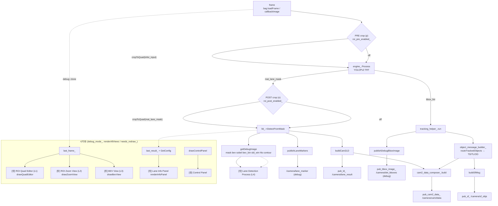

# 차선 검출 시각화·ROI 설계 (as-built)

작성일: 2026-07-24
대상: `src/ws_cam2/src/lane_detection/src/yolopv2_cam2_node.cpp`

> 통합 출처: ROI필터.md + 개발계획.md + 시각화_info범례_구조도_기획서.md (계획 3건 → 구현 완료 통합)

관련 문서: [01_사용법.md](01_사용법.md) · [02_파라미터.md](02_파라미터.md) · [04_소스맵.md](04_소스맵.md) · [05_성능_로드맵.md](05_성능_로드맵.md)

---

## 1. 개요

`yolopv2_cam2_node` 는 원래 별개 계획이던 세 관심사가 한 노드에 합쳐져 있다.

1. **쿼드 ROI 크롭** — 임의 사각형 안쪽만 남기고 바깥 제거 (PRE/POST).
2. **bag 프레임 뷰어** — rosbag2 를 직접 읽어 프레임 단위 재생/탐색.
3. **관리 패널(Control Panel)** — rviz2 Displays 를 경량화한, 마우스로 켜고 끄는 레이어 토글 GUI.

실행 모드는 두 가지이며 `main()` 에서 `isBagMode()`(= `bag_path_` 비었는지) 로 분기한다.

| 모드 | 진입 | 루프 방식 |
|---|---|---|
| **LIVE** | `rclcpp::spin(node)` | 이미지 토픽 구독 → `callbackImage` → `runFramePipeline`, GUI 는 타이머가 펌프/렌더 |
| **BAG** | `node->runBagViewer()` | rosbag2 로 프레임 순회, 자체 `while` + `waitKeyEx` 루프 안에서 파이프라인·패널·마우스·렌더를 직접 처리(spin 없음) |

```cpp
int main(int argc, char ** argv) {
  rclcpp::init(argc, argv);
  auto node = std::make_shared<Yolopv2Cam2Node>();
  if (node->isBagMode()) node->runBagViewer();   // bag 직접 재생/탐색
  else                   rclcpp::spin(node);      // 구독 모드
  rclcpp::shutdown();
}
```

두 모드 모두 프레임 처리는 **공용 `runFramePipeline(frame, header)`** 하나로 수렴한다. BAG 모드에서는 ROS 파라미터 콜백/타이머가 돌지 않으므로 토글은 패널/키로만 조작한다.

---

## 2. 파이프라인 (`runFramePipeline` 공용)

프레임 한 장이 발행까지 흐르는 경로는 다음과 같다.

- `frame` 수신 (debug 모드면 `last_frame_ = frame.clone()`, `frame_updated_ = true`)
- 프레임 크기 변경 시 `rescaleQuadToImage` 로 쿼드 좌표 비례 조정
- **[PRE crop]** `roi_pre_enabled_` → `infer_input = frame.clone()` 후 `cropToQuad(infer_input)` (추론 입력 자체를 크롭)
- `engine_.Process(infer_input, infer_result)` — YOLOPv2 TRT 추론
- **[POST crop]** `roi_post_enabled_` && `!mat_lane_mask.empty()` → `cropToQuad(infer_result.mat_lane_mask)` (마스크 좌표계로 스케일)
- `lld_->DetectFromMask(mat_lane_mask, frame)` → `LaneResult`
- debug 모드면 `last_debug_image_ = lld_->getDebugImage()` (L4/L5 모자이크, `show_*` 반영)
- `publishLaneMarkers(...)` / `buildCam2LD(...)`
- `tracking_helper_.run(bbox_list)` → `object_message_builder_->routeTrackedObjects` → `buildCam2TD/TL/OD`
- `cam2_data_composer_.build(...)` / `buildSfMsg(...)`
- 발행: `pub_cam2_data_`(`/camera/cam2data`) · `pub_ld_`(`/camera/lane_result`) · `pub_sf_`(`/camera/sf_objs`), debug 시 `pub_bbox_image_`



> `toCvShare` 는 ROS 버퍼/공유메모리와 공유하므로 PRE 크롭은 반드시 `frame.clone()` 후 적용한다.

---

## 3. ROI 쿼드 크롭

원본 카메라 영상 기준의 임의 사각형(사다리꼴) 안쪽만 유지하고 바깥을 0 으로 만든다.

### 상태
```cpp
std::array<cv::Point2f, 4> roi_corners_{};   // TL, TR, BR, BL (원본 픽셀 좌표)
bool roi_pre_enabled_;    // 추론 입력 크롭
bool roi_post_enabled_;   // lane_mask 크롭
```
기본값은 이미지 크기 비율로 초기화 — TL(0.30W,0.55H) / TR(0.70W,0.55H) / BR(0.98W,0.98H) / BL(0.02W,0.98H) (상단 좁고 하단 넓은 사다리꼴).

### `cropToQuad(cv::Mat & img)`
`roi_corners_` 를 대상 `img` 크기에 맞춰 스케일(`sx`,`sy`) → `fillConvexPoly` 로 마스크 생성 → 마스크 밖 픽셀 제거. PRE(원본 해상도)와 POST(mask 해상도)가 동일 함수를 재사용하되, 넘겨받은 `img.cols/rows` 기준으로 좌표를 스케일하므로 좌표계 차이가 자동 흡수된다.

| 단계 | 대상 | 좌표 스케일 |
|---|---|---|
| **PRE** (`p`) | `infer_input`(원본 clone) | 원본 해상도 그대로 |
| **POST** (`o`) | `infer_result.mat_lane_mask` | `roi_corners_` → mask 크기로 스케일 |

### 편집 UI — `drawQuadEditor`
`last_frame_` 배경 위에 사다리꼴 폴리라인 + 꼭짓점 핸들을 그리고, 바깥 영역을 `fillConvexPoly` 마스크로 어둡게 표시. 마우스 좌드래그로 클릭 지점에 가장 가까운 꼭짓점을 잡아 이동(`drag_idx_`), 드래그 중엔 `needs_redraw_` 만 세우고 파라미터 push 는 놓을 때 1회. 창은 `display_scale_` 배율로 표시하며 마우스 좌표는 원본 좌표로 역변환한다.

### 파라미터 / 영속성
| 파라미터 | 타입 | 기본 | 의미 |
|---|---|---|---|
| `roi_quad_enable_pre` | bool | false | PRE 크롭 on/off |
| `roi_quad_enable_post` | bool | false | POST 크롭 on/off |
| `roi_quad_pts` | int[8] | 자동 | x0,y0,…,x3,y3 직접 지정 |
| `roi_quad_preset_path` | string | `yaml/roi_quad_preset.yaml` | 프리셋 저장/불러오기 경로 |
| `roi_quad_display_scale` | double | 0.6 | 편집/Zoom 창 표시 배율(`display_scale_`) |

프리셋은 `cv::FileStorage` 로 `roi_quad_enable_pre/post` + `roi_quad_pts`(8좌표)를 R/W (`s`=저장 / `l`=불러오기). 파라미터 변경/토글 시 `syncQuadParameters()` 로 ROS 파라미터에 반영한다.

> **폐기된 구접근**: 기존 `LaneConfig::applyRoiMask`(BEV 640×640 이진영상 중앙 배제, `roi_mid_offset_px`/`roi_half_*_ratio`/`roi_mask_enabled`)는 극성·좌표계·호출경로가 모두 맞지 않아 **본 쿼드 크롭으로 대체**되었다. 헤더에는 남아 있으나 노드 파이프라인(`DetectFromMask` 경로)에서는 사용하지 않는다(archive 참조).

---

## 4. 관리 패널 (Control Panel)

별도 창 `Control Panel` 에 세로로 버튼을 나열한, 직접 그린 HighGUI GUI.

```cpp
struct PanelButton {
  cv::Rect rect;
  std::string label;
  std::function<bool()> get;      // 현재 on/off (색상용)
  std::function<void()> toggle;   // 클릭 동작
};
```

`buildPanelButtons()` 가 그룹별로 버튼을 구성한다.

| 그룹 | 버튼 | 토글 대상 |
|---|---|---|
| **LAYERS** | ROI Editor / Zoom / BEV / Process / Info Panel / Legend / Structure | `show_editor_` / `zoom_view_enabled_` / `bev_view_enabled_` / `show_process_` / `show_info_` / `show_legend_` / `show_structure_` |
| **ROI CROP** | PRE crop / POST crop | `roi_pre_enabled_` / `roi_post_enabled_` (+ `syncQuadParameters()`, `reprocess_current_=true`) |
| **PROCESS STAGES** | stage: mask / bev / sobel / bev_bin / sld_win / hls / contour | `lld_->SetShowFlag(key,…)` (+ `reprocess_current_=true`) |

- **히트박스**: `onPanelMouse` 가 `EVENT_LBUTTONDOWN` 좌표를 각 버튼 `rect.contains` 로 검사 → `toggle()` 실행 후 `needs_redraw_ = true; panel_dirty_ = true`.
- **렌더**: `drawControlPanel()` 이 버튼마다 rect 채우기(ON=초록/off=회색)+라벨, 그룹 헤더를 그린다.
- **팝업 창**: `showLayer(name, mat)` 는 최초 1회 `cv::namedWindow(name, cv::WINDOW_NORMAL)` + `resizeWindow`(`debug_window_scale_` 기본 0.6, 세로 최대 1200 클램프) 로 배치하고 `open_windows_` 에 등록 후 `imshow`. `hideLayer(name)` 는 `destroyWindow` + `open_windows_` 에서 제거. 창 크기는 사용자가 드래그로 조절(WINDOW_NORMAL).

PROCESS STAGES 는 신규 API 없이 `lld_->GetShowFlag/SetShowFlag` 로 런타임 토글하며, 모자이크에 반영하려면 현재 프레임 재처리가 필요하므로 `reprocess_current_` 를 세운다.

---

## 5. 시각화 부가기능

### `withLegend` (해상도 + 함수체인 범례 오버레이)
> 기획서의 `drawLayerLegend` 는 실제로 **`withLegend(img, window_name)`** 로 shipped 됐다(clone-and-return 방식).

- `show_legend_` 가 false 거나 `img` 가 비면 원본을 그대로 반환.
- 아니면 `img.clone()` 위 좌하단에 반투명 검정 박스 + 3줄(제목 / `res WxH` / `fn: 함수체인`)을 오버레이해 반환.
- **누적 방지**: `last_debug_image_` 등 저장본을 재표시해도 항상 clone 사본에만 그리므로 범례가 덧그려져 번지지 않는다.
- 데이터 소스는 창 이름 → `{title, func_chain}` 단일 테이블(`layerMetaTable()`, 기획서의 `kLayerMeta`). 범례와 구조도가 이 테이블을 공유한다.
- `renderAllViews` 에서 각 `showLayer` 직전 `withLegend(...)` 로 감싼다. 패널 `Legend` 버튼(`show_legend_`)으로 전 레이어 일괄 토글.

### `drawStructureDiagram` (라이브 파이프라인 구조도)
- 별도 레이어 `kStructureWindowName = "Pipeline Structure"`, 패널 `Structure` 버튼(`show_structure_`).
- 파이프라인 단계를 박스+화살표로 세로 배치하고, 현재 토글 상태를 **박스 색으로 즉시 반영**:
  - `PRE crop (p)` → `roi_pre_enabled_`, `POST crop (o)` → `roi_post_enabled_`
  - L5 stage(mask/bev/sobel/bev_bin/sld_win/hls/contour) → `lld_->GetShowFlag(key)`
  - 각 레이어(ROI Editor/Zoom/BEV/Process/Info/Legend) → 대응 토글
- 보기 전용. `layerMetaTable()` 을 참조해 라벨/함수명을 일원화한다.

---

## 6. 렌더 최적화 (계획 이후 추가됨)

여러 창을 매 틱 다시 그리면 fps 가 떨어지므로 **`needs_redraw_` 게이트 + 뷰별 캐시 분리**로 재생성을 최소화한다.

`renderAllViews` 첫머리에서 `needs_redraw_` 가 false 면 즉시 반환(재렌더 스킵). 갱신 트리거는 프레임 처리/키/마우스/파라미터 콜백이 `needs_redraw_`(+세부 dirty 플래그)를 세울 때만 발생한다.

| 뷰 | 캐시 | 재생성 조건 |
|---|---|---|
| Control Panel | `panel_cache_` | `panel_dirty_`(버튼 토글) 또는 캐시 empty |
| Info Panel | `info_cache_` | `frame_updated_` 또는 `overlay_dirty_`(재생/탐색/GOTO) 또는 empty |
| BEV View | `bev_cache_` | `frame_updated_`(새 프레임) 또는 empty |
| ROI Editor / Zoom | (캐시 없음) | ROI 꼭짓점에 의존 → 매 렌더 재생성 |

효과: **ROI 드래그처럼 잦은 갱신 시에도** info 패널의 무거운 `putText` 나 BEV `warpPerspective` 는 프레임이 바뀌지 않는 한 재생성을 건너뛴다. 렌더 끝에서 `frame_updated_`/`overlay_dirty_`/`needs_redraw_` 를 모두 내린다.

---

## 7. 창 닫힘 처리 (계획 이후 추가됨)

사용자가 레이어 창을 창 관리자 X 로 닫으면 토글은 여전히 ON 이라 다음 렌더에서 창이 되살아나는 문제가 있었다. `syncClosedWindows()` 가 이를 해소한다.

- `renderAllViews` 맨 앞에서 호출.
- `open_windows_` 에 등록된 레이어마다 `cv::getWindowProperty(name, cv::WND_PROP_VISIBLE) < 1.0` 이면 닫힌 것으로 감지.
- 감지 시: 대응 토글 flag 를 off + `open_windows_` 에서 제거 + `panel_dirty_`/`needs_redraw_` 세움(패널 버튼 색 갱신).

결과적으로 X 로 닫은 창은 토글이 함께 꺼져 다시 살아나지 않는다.

---

## 8. LaneDetection API

시각화 기능(구조도·범례·stage 토글)은 **신규 API 추가 없이** 기존 공개 메서드로 충족한다.

| API | 용도 |
|---|---|
| `GetConfig()` | Info 패널·범례 텍스트용 설정 노출 |
| `GetShowFlag(key)` | PROCESS STAGES 버튼 색·구조도 stage 색 |
| `SetShowFlag(key, on)` | PROCESS STAGES 런타임 토글 (key: mask/preprocessed/bev/gamma/sobel/bev_bin/sld_win/hls/contour) |
| `GetBevHomography()` | BEV 뷰 warp 행렬 |
| `GetBevSize()` | BEV 출력 크기 |

`GetBevHomography`/`GetBevSize` 는 통합 과정에서 이미 추가되어 있었고, 범례/구조도 기획은 이 위에서 **추가 API 없음**으로 확정됐다.
