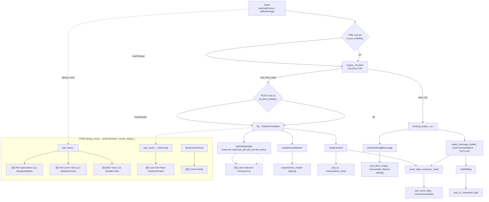

# 시각화 info 범례 × 전체 구조 다이어그램 개발 기획서

작성일: 2026-07-24
브랜치: `#84-lane-roi-test`
대상: `src/ws_cam2/src/lane_detection/src/yolopv2_cam2_node.cpp` (관리 패널 통합본 위에 얹음)
선행: `ROI_lane/0723/개발계획.md` (프레임 뷰어 × ROI 필터 × 관리 패널 통합 — 완료)

---

## 0. 목표
관리 패널 통합본에 **"이 창이 뭘 보여주는지"를 그림 자체가 설명하게** 만드는 두 기능을 추가한다.

1. **기능 A — 시각화 info 범례 토글**
   모든 시각화 창(레이어) 위에 *해상도 + 그 화면을 만든 주요 함수 체인*을 오버레이하는 범례를 얹고,
   관리 패널 버튼으로 켜고 끈다.
2. **기능 B — 전체 구조 다이어그램**
   프레임 한 장이 발행까지 흘러가는 파이프라인 전체를 한눈에 보는 블록 다이어그램.
   (a) 문서용 정적 다이어그램(mermaid, 본 기획서 §5)과 (b) 노드 내장 **라이브 구조도 창**(현재 토글 상태를 색으로 반영) 두 형태.

두 기능 모두 기존 원칙 유지 — OpenCV HighGUI 직접 렌더, 꺼진 레이어는 렌더 스킵(`needs_redraw_`), 별도 앱(rqt/RViz) 없음.

---

## 1. 기능 A — 시각화 info 범례

### 1.1 요구
- 각 레이어 창 구석에 반투명 박스로 다음을 표기:
  - **해상도**: 실제 표시 중인 이미지 크기 `WxH` (+ 원본 대비 배율 `display_scale_`/`debug_window_scale_`).
  - **주요 함수**: 그 화면을 만든 함수 체인 (예: `last_frame_ → cropToQuad → drawQuadEditor`).
- 관리 패널 `LAYERS` 그룹에 **`Legend` 버튼** 1개로 전 레이어 일괄 토글(전역 `show_legend_`).
- 기존 각 뷰의 제목 `putText`(예: "BEV (calibrated top-view)")와 겹치지 않게 **좌하단** 또는 **우상단** 고정.

### 1.2 레이어별 범례 데이터(확정 매핑)
현재 코드의 창 이름 상수 → 소스 함수 체인. `drawStructureDiagram`/범례가 공유할 단일 테이블로 정의.

| 창(상수) | 해상도 출처 | 주요 함수 체인 |
|---|---|---|
| `kRoiQuadWindowName` (L1) | `drawQuadEditor` 반환 mat = 원본 × `display_scale_` | `last_frame_` → `fillConvexPoly`(바깥 어둡게, 편집뷰 자체 처리) → `drawQuadEditor` |
| `kRoiZoomWindowName` (L2) | `getPerspectiveTransform` 결과 `img_w_×img_h_` × scale | `roi_corners_` → `getPerspectiveTransform` → `warpPerspective` → `drawZoomView` |
| `kRoiBevWindowName` (L3) | `lld_->GetBevSize()` | `lld_->GetBevHomography` → `warpPerspective` → `drawBevView` |
| `kLaneDebugWindowName` (L4) | `last_debug_image_.size()` | `engine_.Process` → `DetectFromMask` → `getDebugImage` |
| `kLaneInfoWindowName` | `renderInfoPanel` 계산 크기 | `last_result_` + `lld_->GetConfig` → `renderInfoPanel` |
| `kPanelWindowName` | `250 × panel_height_` | `buildPanelButtons` → `drawControlPanel` |

### 1.3 구현 설계
```cpp
struct LayerMeta { std::string title; std::string func_chain; };
static const std::map<std::string, LayerMeta> kLayerMeta = { ... };  // 창 이름 → 메타

// 범례 오버레이: img 위 좌하단에 반투명 박스 + (제목/해상도/함수체인) 2~3줄.
void drawLayerLegend(cv::Mat & img, const std::string & window_name) const;
```
- **호출 지점**: `renderAllViews()` 안, `showLayer(name, mat)` **직전**. `show_legend_` 일 때만.
- **누적 방지(중요)**: `last_debug_image_` 는 프레임 재처리 없이 여러 번 재표시되므로(저장본 재사용) 그 위에 직접 그리면 범례가 덧그려져 번진다.
  → `drawLayerLegend` 는 항상 **넘겨받은 mat의 clone 위에 그려 반환**하거나, 저장본은 건드리지 않고 표시용 사본에만 오버레이. `drawQuadEditor`/`drawZoomView`/`drawBevView`/`renderInfoPanel` 은 매번 새 mat 을 반환하므로 무관하나 일관성 위해 clone 경로로 통일.
- **해상도 텍스트**: `img.cols × img.rows` + (해당되면) 배율. L4/Info 는 원본이 이미 스케일 반영된 크기이므로 표시 크기 그대로.

### 1.4 관리 패널 변경
`buildPanelButtons()` 의 `LAYERS` 그룹 끝에 1행 추가:
```cpp
btn("Legend", [this]{ return show_legend_; }, [this]{ show_legend_ = !show_legend_; });
```
토글 시 `needs_redraw_ = true`(패널 마우스 콜백이 이미 세팅). 재처리 불필요(`reprocess_current_` 무관).

---

## 2. 기능 B — 전체 구조 다이어그램

### 2.1 요구
프레임 → 추론 → 검출 → 발행까지의 **데이터 흐름 + 현재 설정 상태**를 한 창에서 파악.
정적 문서 다이어그램만으로는 "지금 PRE 켜졌나 / 어느 stage 가 on 인가"를 못 보므로, **라이브 상태 반영 구조도 창**을 노드에 내장한다.

### 2.2 라이브 구조도 창 (`drawStructureDiagram`)
- 새 레이어 `kStructureWindowName = "Pipeline Structure"`, `LAYERS` 그룹에 `Structure` 버튼(전역 `show_structure_`).
- 파이프라인 각 단계를 **박스 + 화살표**로 세로 배치. 박스 색으로 **현재 상태**를 표현:
  - PRE crop 박스: `roi_pre_enabled_` → 초록(ON)/회색(off)
  - POST crop 박스: `roi_post_enabled_` → 초록/회색
  - `getDebugImage` 하위 stage(mask/bev/sobel/bev_bin/sld_win/hls/contour): `lld_->GetShowFlag(key)` → 켜진 것만 강조
  - 각 레이어 박스(L1~L4/Info): 해당 토글(`show_editor_`/`zoom_view_enabled_`/…) on 이면 강조
- 발행 토픽(`pub_cam2_data_`/`pub_ld_`/`pub_sf_`/`pub_lane_marker_`/`pub_bbox_image_`)은 말단 노드로 표기.
- **재사용**: §1.2 `kLayerMeta` 테이블을 그대로 참조 → 박스 라벨/함수명 일원화.
- 클릭 없이 보기 전용(1차). 여력되면 박스 클릭 → 해당 레이어 토글(패널과 동일 동작)로 확장.

### 2.3 배치(초안)
```
 [frame: bag loadFrame / callbackImage]
              │
     ┌────────┴─────────┐
     │  PRE crop (p)     │  roi_pre_enabled_
     └────────┬─────────┘
   [engine_.Process — YOLOPv2 TRT]
              │  mat_lane_mask / bbox_list
     ┌────────┴─────────┐
     │  POST crop (o)    │  roi_post_enabled_
     └────────┬─────────┘
  [lld_->DetectFromMask] ──▶ getDebugImage(L5 stages) ─▶ [Process 창]
        │                         mask·bev·sobel·bev_bin·sld_win·hls·contour
        ├─ publishLaneMarkers ─▶ /camera/lane_marker (debug)
        └─ buildCam2LD ┐
  [tracking_helper_.run] ─▶ [object_message_builder_] ─▶ TD/TL/OD
                          └──────────────┬─────────────┘
                     cam2_data_composer_.build / buildSfMsg
                          │
      pub_cam2_data_ · pub_ld_ · pub_sf_ · (debug) pub_bbox_image_
```

---

## 3. 신규/변경 목록

### 3.1 멤버 추가 (`Yolopv2Cam2Node`)
```cpp
bool show_legend_{false};      // 기능 A: 범례 오버레이 전역 토글
bool show_structure_{false};   // 기능 B: 구조도 창 토글
```

### 3.2 함수 추가
| 함수 | 역할 |
|---|---|
| `drawLayerLegend(cv::Mat&, const std::string& win)` | 레이어 위 해상도+함수 범례 오버레이(clone) |
| `drawStructureDiagram()` | 라이브 파이프라인 블록 다이어그램 mat 생성 |
| (테이블) `kLayerMeta` | 창 이름 → {title, func_chain} 단일 소스 |

### 3.3 기존 함수 수정
- `buildPanelButtons()`: `LAYERS` 그룹에 `Legend`, `Structure` 버튼 2행 추가.
- `renderAllViews()`: 각 `showLayer` 직전 `show_legend_` 면 `drawLayerLegend` 적용;
  `show_structure_` 면 `showLayer(kStructureWindowName, drawStructureDiagram())`, 아니면 `hideLayer`.
- 창 이름 상수 블록에 `kStructureWindowName` 추가.

### 3.4 LaneDetection API
- **추가 없음.** 이미 있는 `GetShowFlag`/`GetConfig`/`GetBevSize` 로 충분(구조도 stage 색, 범례 텍스트).

---

## 4. 작업 순서 & 검증
1. `kLayerMeta` 테이블 + `kStructureWindowName` 상수 정의.
2. `show_legend_`/`show_structure_` 멤버 + 패널 버튼 2행 추가 → 빌드.
3. `drawLayerLegend` 구현 → `renderAllViews` 훅 연결 → 각 창에 해상도/함수 표시 확인(누적 번짐 없는지).
4. `drawStructureDiagram` 구현(박스/화살표/상태색) → 토글로 창 표시.
5. bag 검증: PRE/POST·stage 를 패널로 켜고 끄며 **구조도 박스 색이 즉시 바뀌는지**, 범례 해상도가 창 크기 조절과 무관히 *이미지* 해상도를 정확히 보이는지.

## 5. 전체 구조 다이어그램 (문서용, mermaid)


## 6. 리스크 / 확인
- **범례 누적 번짐**: `last_debug_image_` 등 저장본 재사용 mat 에 직접 오버레이 금지 → clone 경로 통일(§1.3).
- **해상도 표기 의미**: 창을 드래그로 키워도 범례 숫자는 *렌더 이미지* 해상도(불변)여야 함. 창 크기(사용자 조절)와 혼동 금지.
- **구조도 최신성**: `show_structure_` 도 `needs_redraw_` 게이트에 걸리므로, 유휴 상태에서 stage 토글 시 재렌더 트리거되는지 확인(패널 콜백/`handleQuadKey`가 이미 `needs_redraw_` 세팅).
- 창 개수 증가(최대 +2) → fps 영향 경미하나 꺼진 창은 `hideLayer`로 파괴 유지.

## 7. 산출물
- `yolopv2_cam2_node.cpp` 수정(`drawLayerLegend`, `drawStructureDiagram`, `kLayerMeta`, 패널 버튼 2행, 멤버 2개).
- 본 기획서 mermaid → 필요 시 `ROI필터.md` 로 병합.
- LaneDetection 변경 없음.
